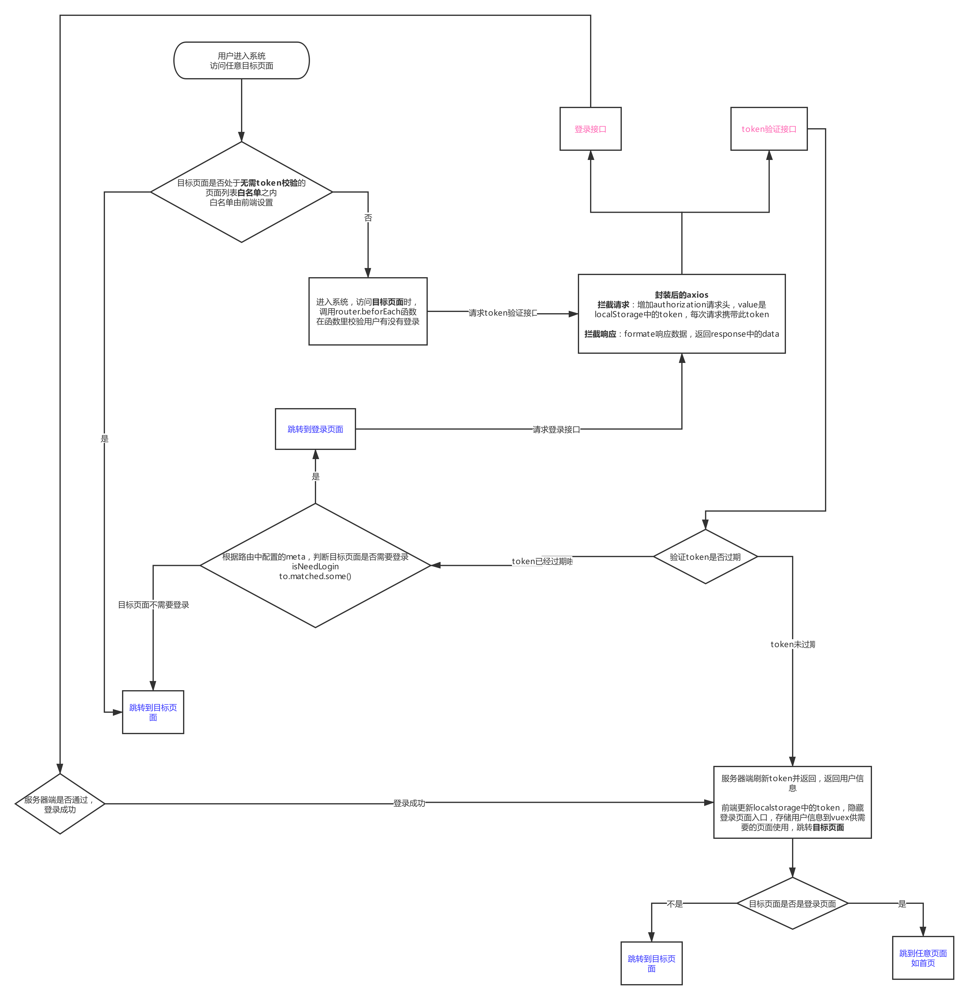

# jwt实现

2019/10/03 01:17
<!-- TOC -->

- [什么是jwt](#什么是jwt)
- [jwt流程图](#jwt流程图)
- [axios 封装](#axios-封装)

<!-- /TOC -->
## 什么是jwt

jwt 全称 json web token，可以看成是基于token的登录权限控制

## jwt流程图



## axios 封装

```js
class AjaxRequest {
  constructor() {
    this.baseURL = process.env.NODE_ENV === 'development' ? 'http://localhost:3000' : '/'
    this.timeout = 2000
  }
  request(config) {
    const instance = axios.create({
      baseURL: this.baseURL,
      timeout: this.timeout
    })

    // 设置拦截器
    instance.interceptors.request.use((config) => {
      config.header.Authorization = localStorage.getItem('token')
      return config
    }, err => Promise.reject(err))

    instance.interceptors.response.use(res => res.data, err => Promise.reject(err))

    return instance(config)
  }
}

export default new AjaxRequest()
```
