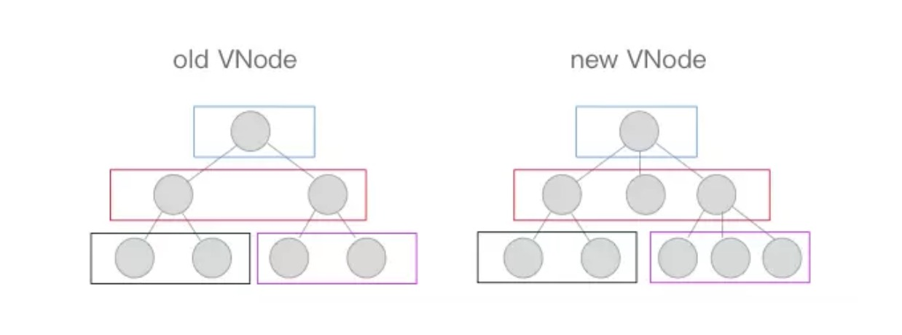

# vue源码解读

2019/09/28 14:49

<!-- TOC -->

- [概念](#概念)
  - [VNode 是什么](#vnode-是什么)
  - [Virtual DOM 是什么](#virtual-dom-是什么)
  - [依赖收集](#依赖收集)
  - [diff算法](#diff算法)

<!-- /TOC -->

## 概念

### VNode 是什么

VNode 就是一个用来描述dom元素的js对象

由 `render function` 生成

### Virtual DOM 是什么

Virtual DOM 其实就是一棵以 JavaScript 对象（VNode 节点）作为基础的树。

它只是一层对真实 DOM 的抽象，最终可以通过一系列操作使这棵树映射到真实环境上。由于 Virtual DOM 是以 JavaScript 对象为基础而不依赖真实平台环境，所以使它具有了跨平台的能力，比如说浏览器平台、Weex、Node 等。

### 依赖收集

### diff算法

diff 算法可以比对出两虚拟dom颗树的「差异」

diff 算法是通过同层的树节点进行比较而非对树进行逐层搜索遍历的方式，所以时间复杂度只有 O(n)，是一种相当高效的算法

