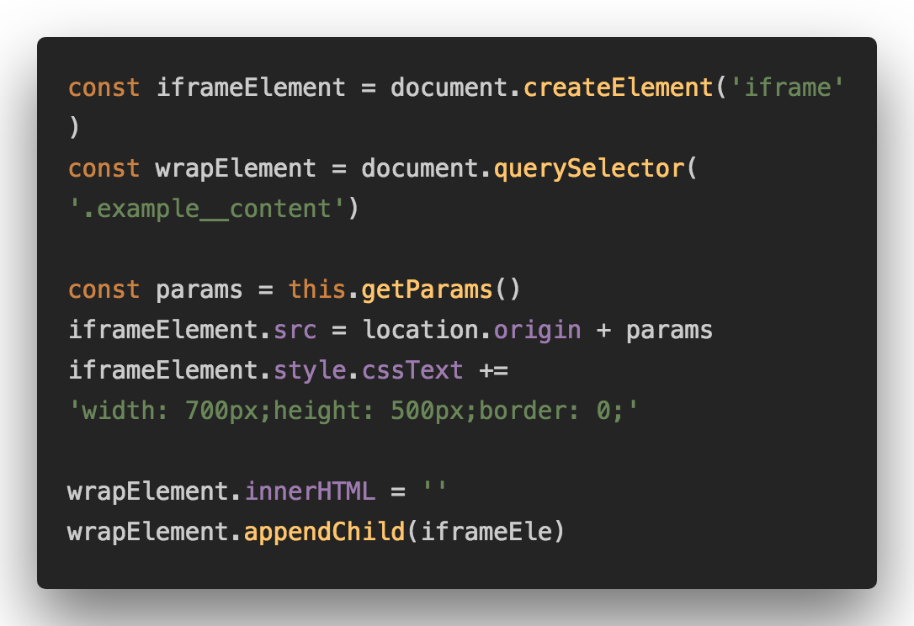
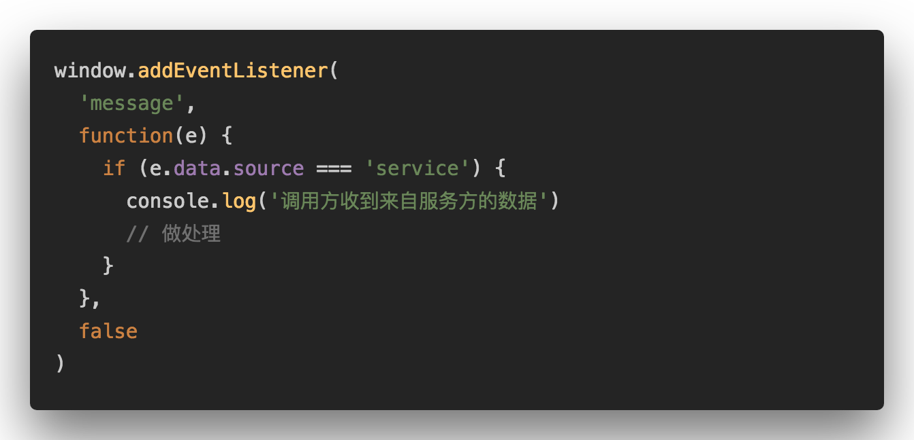
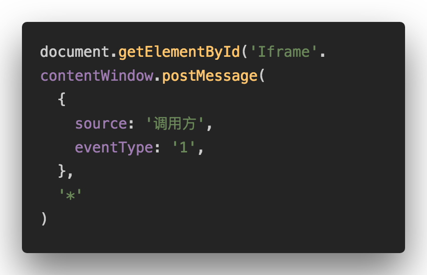
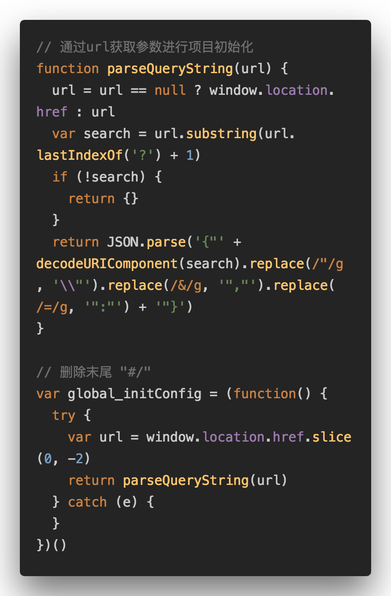
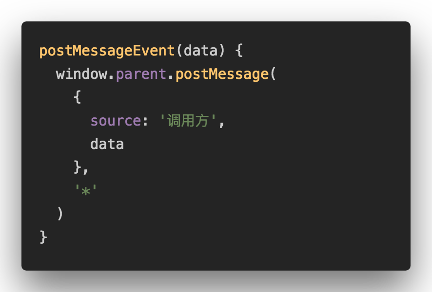

# 使用 postMessage 解决 iframe 跨域通信问题

## 概念

**调用方**：调用iframe服务的一方

**服务方**：在iframe中，开发页面服务的一方

## 调用方

1. 调用方使用url传参方式对iframe项目进行初始化
   

2. 监听服务方派发出的事件
   

3. 调用方通过postMessage向服务方传递数据
   

## 服务方

1. 服务方通过url获取参数，对项目进行初始化
   

2. 服务方派发消息给调用方
   
