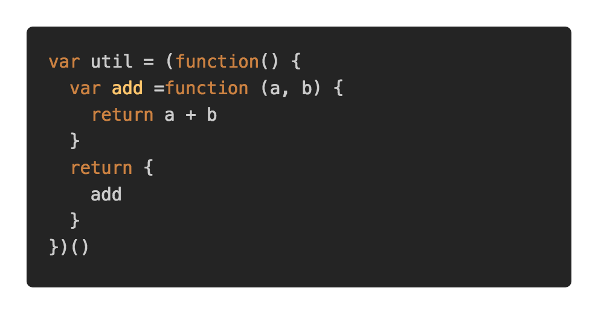
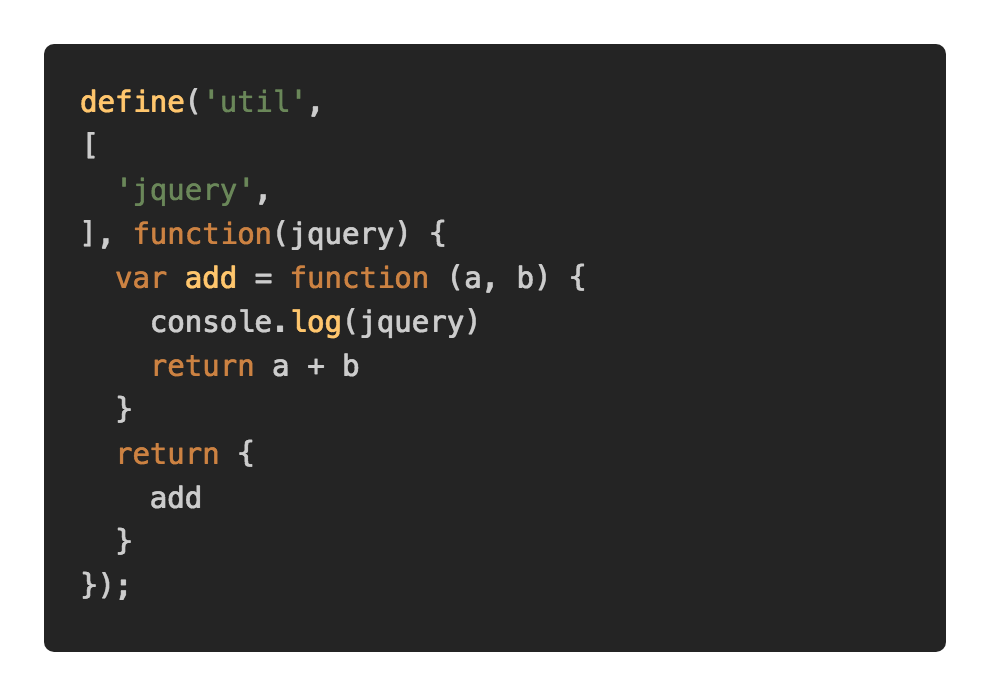
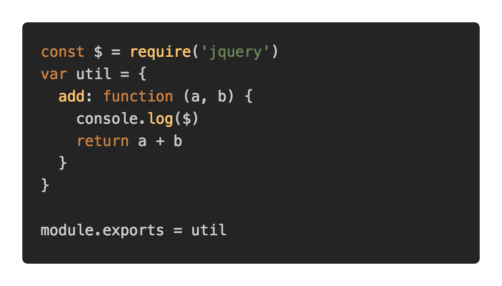
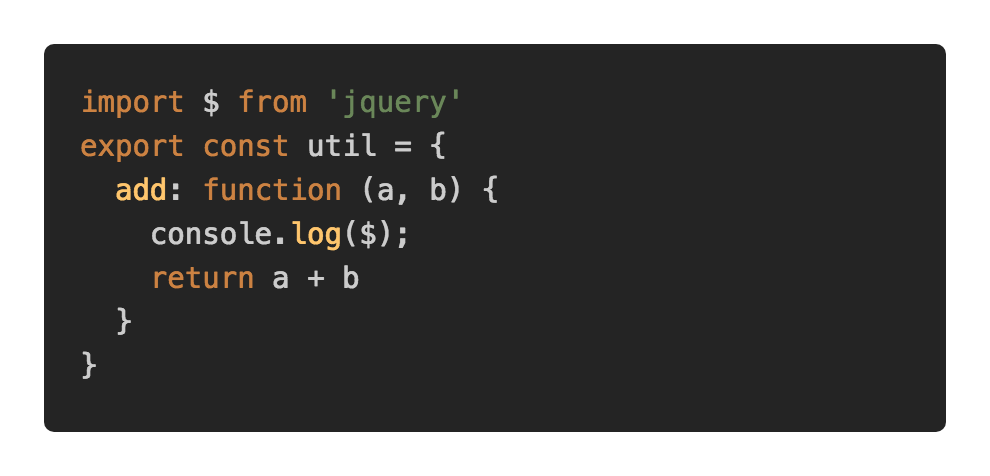

# 前端模块化

2019/10/02 22:37

<!-- TOC -->

- [模块的基本要求](#模块的基本要求)
- [模块接口](#模块接口)
- [四种模块方式实现](#四种模块方式实现)
  - [函数模块](#函数模块)
  - [AMD 和 CommonJs](#amd-和-commonjs)
    - [AMD](#amd)
    - [CommonJs](#commonjs)
  - [UMD](#umd)
  - [ES6](#es6)
    - [导出](#导出)
    - [导入](#导入)
    - [主文件进行模块管理](#主文件进行模块管理)

<!-- /TOC -->

## 模块的基本要求

1. 隐藏模块内部实现，使模块的使用者无需关注模块内部实现的细节
2. 对外定义模块的访问接口，通过接口可以调用模块功能

## 模块接口

模块接口通常包含一组变量和函数，创建接口最简单的方式是使用js对象

## 四种模块方式实现

目标：实现一个util模块，外部可以调用模块的add工具方法

### 函数模块

使用自执行的匿名函数（IIFE）实现隐藏内部实现要求

使用闭包、对象实现对外定义模块的访问接口要求

扩展时，需要调用一个IIFE，改函数接收需要扩展的模块变量作为参数



函数模块缺点

1. 通过模块扩展无法共享模块的私有变量
2. 当我们开始创建模块化应用时，模块本身尝尝依赖其他模块的功能，然而函数模块模块无法实现这些依赖关系

### AMD 和 CommonJs

为了弥补函数模块的缺点，AMD 与 CommonJs两大**标准**产生，并相互竞争。

#### AMD

1. ADM最流行的实现是**RequireJs**
2. 设计理念是明确基于浏览器
3. 自动处理依赖，无需考虑模块引入问题
4. 异步加载依赖模块，避免阻塞 （解决前端应用场景中向服务器请求依赖模块文件问题）
5. 所有依赖模块加载完毕后，调用模块的工厂函数，并传入依赖模块
6. 在同一个文件中可以定义多个模块
7. 对外提供模块访问接口的实现方式与函数模块一致



#### CommonJs

1. 每个文件，只能定义一个模块
2. module.exports 作为模块的公共接口
3. 可以引入依赖模块，依赖同步加载 （由于服务器端常读磁盘文件，速度较快，与http请求速度不在同一个量级，所以使用同步加载）
4. 变量可以定义在文件的顶部，虽然是顶部，但仍属于模块内部的局部变量
5. nodeJs 默认的模块标准

CommonJs缺点

不显示的支持浏览器



### UMD

在模块规范百家争鸣下，为实现统一的模块化标准，UMD产生了。

先判断运行环境是否支持cjs，然后判断是否支持amd，如果都不支持，则使用函数模块方式（IIFE），生成一个全局变量。

### ES6

主要思想：必须显式的使用标识符导出模块，才能从外部访问模块

虽然变量可以定义在模块顶部，但是仍然只能在模块内部访问变量

目前浏览器尚未支持ES6模块，如果现在需要ES6模块，需要对代码进行编译，可以使用Traceur 或 babel 或 typescript

#### 导出

代码 | 含义
-|-
export const add = (a, b) => a + b | 导出变量
export function add (a, b) { return a + b} | 导出函数
export class add {} | 导出类
export default class add {} | 导出默认类
export default function() {} | 导出默认函数
export default add | 导出默认对象
export { add, delete } | 导出存在的变量  命名导出
export { add as add1 } | 使用别名导出变量
export default function () {} export { add } | 同时使用默认导出和命名导出

#### 导入

代码 | 含义
-|-
import add from './add' | 导入默认导出
import { add } from './add' | 导入命名导出
import * as all from './add' | 导入模块中声明的全部导出
import add, { add } from './add' | 同时导入默认导出和命名导出
import { add as add1 } from './add' | 通过别名导入模块中声明的全部导出，到本模块依赖两个不同模块内容，并且依赖内容命名一致时使用



#### 主文件进行模块管理

```js
// util/index.js
export * from 'shared/util'
export * from './lang'
export * from './env'
export * from './options'
export * from './debug'
export * from './props'
export * from './error'
export * from './next-tick'
export { defineReactive } from '../observer/index'

// a.js
import { toArray } from './util/index.js'
```
