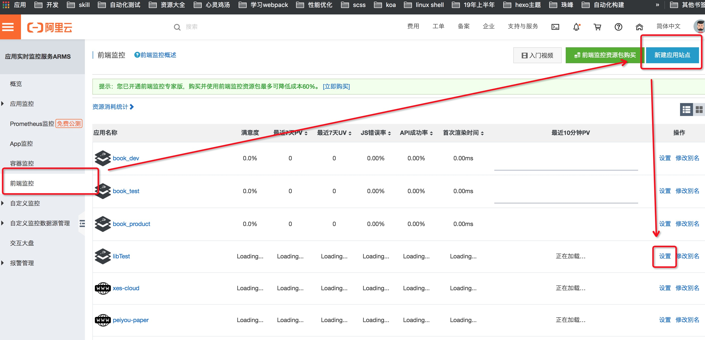
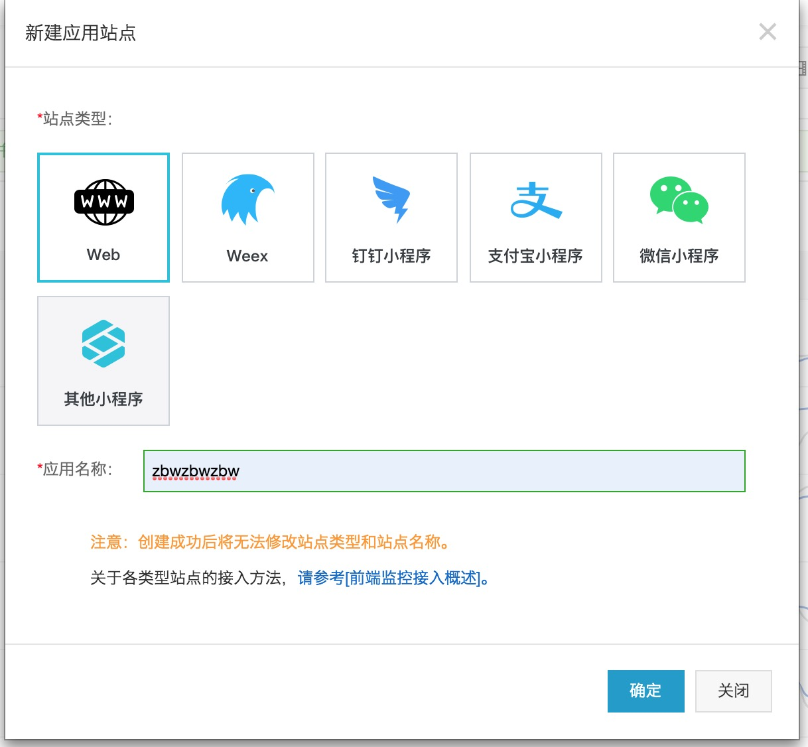

# 前端监控

2019/09/22 16:28

<!-- TOC -->

- [前端监控是什么](#前端监控是什么)
- [为什么要有前端监控](#为什么要有前端监控)
- [如何为网站设置前端监控](#如何为网站设置前端监控)
- [实现原理](#实现原理)
- [参考资料](#参考资料)

<!-- /TOC -->

## 前端监控是什么

前端监控主要从以下三个方面监测网站运行时的健康程度。

- 页面打开速度
- 页面稳定性（js报错）
- 外部服务调用成功率（api）

## 为什么要有前端监控

用户访问我们的业务时，整个访问过程大致可以分为三个阶段：页面生产时（Server 端状态）、页面加载时和页面运行时。

为了保证线上业务稳定运行，我们会在 Server 端对业务的运行状态进行各种监控。现有的 Server 端监控系统相对已经很成熟了，而页面加载和页面运行时的状态监控一直比较欠缺。例如：

无法第一时间获知用户访问我们的站点时遇到的错误；
各个国家、各个地区的用户访问我们站点的真实速度未知；
每个应用内有大量的异步数据调用，而它们的性能、成功率都是未知的。

## 如何为网站设置前端监控

申请阿里云账号——购买服务，[登录](https://signin.aliyun.com/1796066747675887/login.htm)

## 实现原理

购买服务后，添加应用，会为你生成一个唯一阿里云监控可以识别 `pid`, 在应用的js代码中，通过调用cdn公开接口的方式，将pid传给阿里云，阿里云自动帮助网站进行监控。

## 参考资料

[阿里云前端监控](https://help.aliyun.com/document_detail/58652.html?spm=a2c4g.11186623.6.617.d26b3ddfk41C9a)
