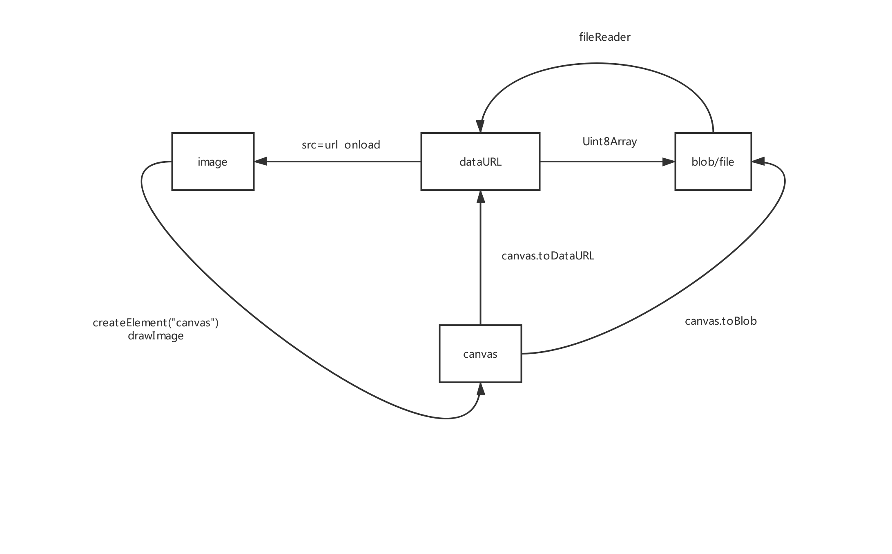

# 图片资源相关

2019/09/28 13:33

## 与图片相关的数据类型有哪些

1. image对象（js）=> appendTo Body => img元素（dom）
2. dataUrl（base64、url）
3. file(基于blob)文件对象
4. canvas对象

## 图片各种数据类型间转换



## src属性值可以是哪些

1. url地址
2. base64

## 获取图片宽高等数据

```js
const img = new Image()

// 图片对象读取完毕后即可获取图片相关属性
img.onload = function () {
  const width = this.width
  const height = this.height
}
img.src = 'xxxxxxxx'
```
