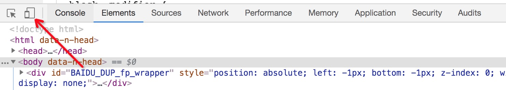

# 调试移动端H5页面

2019/09/08 13:04

<!-- TOC -->

- [如何在手机上访问开发环境的页面](#如何在手机上访问开发环境的页面)
- [chrome控制台](#chrome控制台)
- [调试ios手机](#调试ios手机)
- [调试安卓手机](#调试安卓手机)
- [调试嵌入式H5](#调试嵌入式h5)
- [相关资料](#相关资料)

<!-- /TOC -->

## 如何在手机上访问开发环境的页面

1. 手机、电脑处于同一个无线网路中
2. 通过草料二维码，将电脑端开发环境的页面地址（通过本机id访问）转化成二维码
3. 手机扫码，通过浏览器打开

## chrome控制台

模拟调试移动端样式及部分交互事件

## 调试ios手机

1. 打开手机——设置——safari浏览器——高级——打开JavaScript、Web检查器
2. 手机通过数据线连接电脑
3. 打开电脑端safari浏览器——开发选项，即可显示手机名称标识，及当前手机safari所打开的页面

## 调试安卓手机

1. 打开安卓手机设置——开发者选项——打开开发者模式、打开usb调试
2. 保证手机和电脑在同一网段内
3. 在手机中的谷歌浏览器中使用ip的方式打开应用页面
4. 电脑谷歌url输入 `chrome://inspect/#devices`
5. 勾选 `Discover USB devices`
6. 在下方可以看到目标手机的相关信息，选择目标网址下方的 `inspect` 开始调试

**注意**：谷歌浏览器的安卓手机调试页面，需要科学上网才可以打开，否则会出现黑屏的情况。

## 调试嵌入式H5

1. **charles抓包调试请求**
   [Charles - 抓取https包内数据](https://www.jianshu.com/p/9d7c4cb14f2c)
   [利用 Charles Proxy 下载旧版本 iOS App【转】](https://www.jianshu.com/p/0ed1ed8161f1)

   ios手机在安装完证书之后，需要设置如下：
   通用——描述文件
   通用——关于本机——证书信任

## 相关资料

- [论：怎么调试H5手机页面](https://www.jianshu.com/p/ef94d0813b6b)
