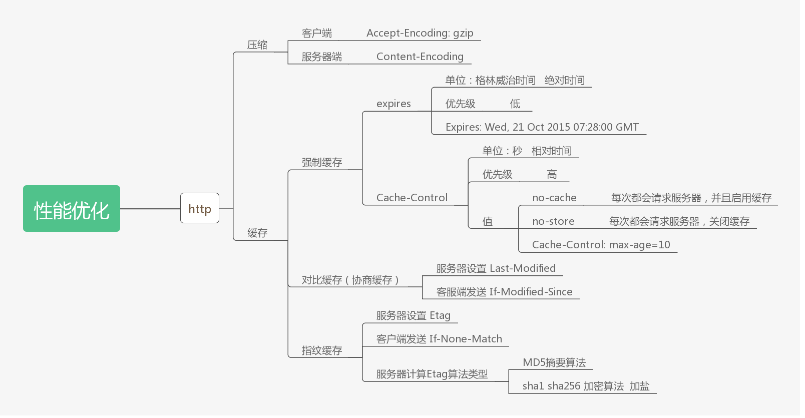

# 性能优化——http
<!-- TOC -->

- [http主要优化方式](#http主要优化方式)
- [压缩](#压缩)
  - [http压缩与uglify压缩区别](#http压缩与uglify压缩区别)
  - [压缩流程](#压缩流程)
  - [压缩原理](#压缩原理)
  - [压缩实战](#压缩实战)
- [缓存](#缓存)
  - [浏览器缓存是什么](#浏览器缓存是什么)
  - [缓存的实现方式](#缓存的实现方式)
  - [index.html是否会被缓存](#indexhtml是否会被缓存)
  - [强制缓存——Expires、Cache-Control、200](#强制缓存expirescache-control200)
    - [什么是强制缓存](#什么是强制缓存)
    - [强制缓存缺陷](#强制缓存缺陷)
    - [Cache-Control 与 Expires 区别](#cache-control-与-expires-区别)
    - [Cache-Control中 no-store 和 no-cache 区别](#cache-control中-no-store-和-no-cache-区别)
  - [对比缓存/协商缓存——Last-Modified、304](#对比缓存协商缓存last-modified304)
    - [什么是对比缓存](#什么是对比缓存)
    - [对比缓存缺点](#对比缓存缺点)
  - [指纹缓存——Etag、304](#指纹缓存etag304)
    - [什么是指纹缓存](#什么是指纹缓存)
    - [什么是MD5](#什么是md5)
    - [使用MD5](#使用md5)
    - [什么是加盐](#什么是加盐)
  - [最佳实践](#最佳实践)
  - [常见问题总结](#常见问题总结)

<!-- /TOC -->
## http主要优化方式

1. **压缩**
2. **缓存**

## 压缩

### http压缩与uglify压缩区别

1. uglify压缩js代码中的空格、空行，混淆代码指将过长变量名统一替换成简单字符

2. http压缩是将文件内容中重复的部分进行压缩，如html中重复的标签名，重复的部分越多，压缩质量越高

   视频，音频相关的文件，压缩质量很低

   压缩完是可以解压的，而不是删除内容

### 压缩流程

1. 客户端发出http请求文件时，请求头中的 `Accept-Encoding` 字段告知服务器，自身支持哪种压缩格式

   例：`Accept-Encoding: br;q=1.0, gzip;q=0.8, *;q=0.1`

   q是权重 1最高

2. 服务器收到请求后，根据请求头中的 `Accept-Encoding`  字段知道了客户端浏览器支持的压缩格式，如果有压缩，没有就不压缩。压缩完成后，写入文件，返回给客户端浏览器

   并在 `response Header` 中返回 `content-encoding` 字段告知浏览器，文件是以什么样的格式进行压缩的，否则浏览器无法正确解析压缩过后的文件，会出现乱码

   例：`content-encoding: gzip`

   node压缩格式一般是 `gzip、 deflate`

### 压缩原理

压缩功能实现是使用node专用于做压缩的zlib模块，zlib模块压缩方式：

1. 同步压缩：等文件所有内容压缩完，在返回给客户端

2. 流式压缩：一边压缩一边返回

   实际上是借助**转换流**的概念，将目标文件读取出来，经过转换流压缩，在返回给客户端。

   `可读流.pipe(zlib.createGzip()).pipe(可写流)`

### 压缩实战

1. webpack 的 devServer 中的 `compress` 属性

## 缓存

### 浏览器缓存是什么

浏览器缓存指，客户端浏览器请求服务器获取到资源后，同时会将资源复制一份以**二进制文件**的形式缓存至**本地硬盘**中的一个文件内。

再次请求服务器同一资源时，会被服务器返回的信息告知从自己的缓存文件夹中获取即可。

这个交互过程实现了资源的缓存

### 缓存的实现方式

1. **强制缓存**
2. **对比缓存（协商缓存）**
3. **指纹缓存**

### index.html是否会被缓存

使用强制缓存时，首页不会被缓存，必须要发送请求，请求资源

原因是为了防止出现`网都挂了，百度还能访问`的情况，但是首页引用的其他资源如js，可以实现缓存

使用对比、指纹缓存时，首页是会被缓存的。304

### 强制缓存——Expires、Cache-Control、200

#### 什么是强制缓存

客户端发起请求，服务器在返回资源的同时，在**响应中**设置 `Cache-Control` 或者 `Expires` 告知客户端浏览器：**10秒之内**、或在**规定日期之前**不要再找我了，从你的缓存文件夹中取！

走强制缓存时，响应状态码为200

#### 强制缓存缺陷

服务器文件更新之后，在没有超过规定时间时，客户端浏览器仍会走缓存，访问旧文件

#### Cache-Control 与 Expires 区别

1. 写法不同

   `Cache-Control: max-age=10`

   `Expires: Expires: Wed, 21 Oct 2015 07:28:00 GMT`
2. 单位不同

   Cache-Control 单位是**秒**，是**相对时间**，表示多少秒之后

   Expires 单位是UTC，也就是我们所说的**格林威治时间**，指的是time中的**世界时间标准**。是绝对时间，表示过期时间是什么时候。
3. 权重不同

   因为Expires是老版本设置， 设置Cache-Control 会覆盖掉 Expires

#### Cache-Control中 no-store 和 no-cache 区别

no-store 表示浏览器没有缓存

no-cache 表示浏览器有缓存，但是请求时，会请求服务器。请求服务器干啥呀？ 为了实现对比缓存。询问服务器用缓存还是返回服务器上最新的文件

no-cache 这种请求服务器，但是根据文件最后修改时间或者MD5产生的Etag告知浏览器是否使用缓存的形式，返回304状态码。即对比缓存和指纹缓存都是返回304

### 对比缓存/协商缓存——Last-Modified、304

#### 什么是对比缓存

对比缓存对比的是什么： 文件最后更新时间

使用 `cache-control = no-cache` + `Last-Modified`

客户端请求第一次时，服务器在response中给这个资源设置一个标识 `Last-Modified` ，告之客户端所请求的这个资源文件的最新修改时间。

客户端下次再请求时，在request中会携带 `If-Modified-Since` 这个时间戳标识，服务器获取对应资源的最后更新时间，比较这两个时间，如果不同，证明后来又被修改过，返回新文件。否则告知客户端：文件没有变化，从缓存中去取吧。

走对比缓存时，**响应状态码为304**

#### 对比缓存缺点

1. 反复操作文件，虽然文件内容没变，但是最后修改时间改了。客户端不会走缓存。
2. 使用cdn时，每个文件分发到cdn的时间不同。但是内容是一样的，但是用户的位置不确定，cdn都是就近分发，会导致每次请求的文件可能来自不同的cdn

### 指纹缓存——Etag、304

走指纹缓存时，**响应状态码也为304**

#### 什么是指纹缓存

首次接到请求后，摘要/加盐文件部分内容，生成唯一key，名为 `Etag` 传给客户端。

客户端下次再请求同一文件时，在request中加入请求头 `If-None-Match`

服务器端收到后作比较，更加准确的判断文件是否被修改过，后续同对比缓存

例

`ETag: "33a64df551425fcc55e4d42a148795d9f25f89d4"`

`If-None-Match: "33a64df551425fcc55e4d42a148795d9f25f89d4"`

#### 什么是MD5

MD5是一种信息摘要算法，摘取文件部分内容。

MD5本来也不是作加密使用，而是用来**校验数据的完整性**。

MD5不算是加密算法，因为摘要不代表全部内容，不可解密，不可反推，就是无论多大数据，经过算法运算后都是**生成固定长度**的数据。

相同的内容摘要的结果相同。有一点不同，摘要的结果完全不同。

#### 使用MD5

`Crypto.createHash('md5').update('文件部分内容' + random() ).digest('base64')`

由于MD5大家都知道，很容易被猜到，所以在摘要时加一个随机数。

#### 什么是加盐

使用 `sha1` `sha256` 这种加密算法，流程同MD5相同

### 最佳实践

开启所有类型缓存，只要有一个失效，就算失效。

首先走强制缓存，如果强制缓存在，那直接走浏览器缓存。如果强制缓存失效了，就会请求服务器，此时走对比缓存，比较文件的最后修改时间，如果文件没有修改，返回304。

先**强制缓存（200）**——再对比缓存和指纹缓存（两者有一个失效就算过期）

那么**问题来了**，这样设置时，在强制缓存下，缓存没过期时，服务器端更改了文件，客户端不一样拿不到最新的文件吗。

我们所说的缓存多用于静态资源和图片（static文件夹），对于经常改编的js逻辑，在正式生产环境打包时，会生成不同的hash值。

由于index.html文件不会被缓存，所以该文件中引入的js文件即时打包生成带有最新的hash值的js。所以请求会指向新的URI，不会走缓存。

### 常见问题总结

1. 缓存设置操作只能在服务器端进行，客户端浏览器能做什么？

   前端并不能做什么。缓存这件事，让服务器端去搞。
2. 首页index.html即使没有加hash戳也是不会被缓存的，防止出现断网时仍能访问页面的情况
3. 浏览器network上，有一个小按钮，可以禁用所有缓存
4. 关于 `Cache-Control` 响应头的值，当服务器设置为 `no-cache` 时，代表每次请求会都访问服务器，但是也会走缓存。当值为 `no-store` 才表示所有的请求，都不会走缓存
5. 在进行指纹缓存时，node服务器端多使用 `Crypto` 第三方模块
6. 服务器端设置各种响应头标识（`Last-Modified等`）当前文件最新状态，那客户端浏览器第二次发给服务器时，需要手动把这个标识设置到请求头吗？

   不需要，浏览器会携带

